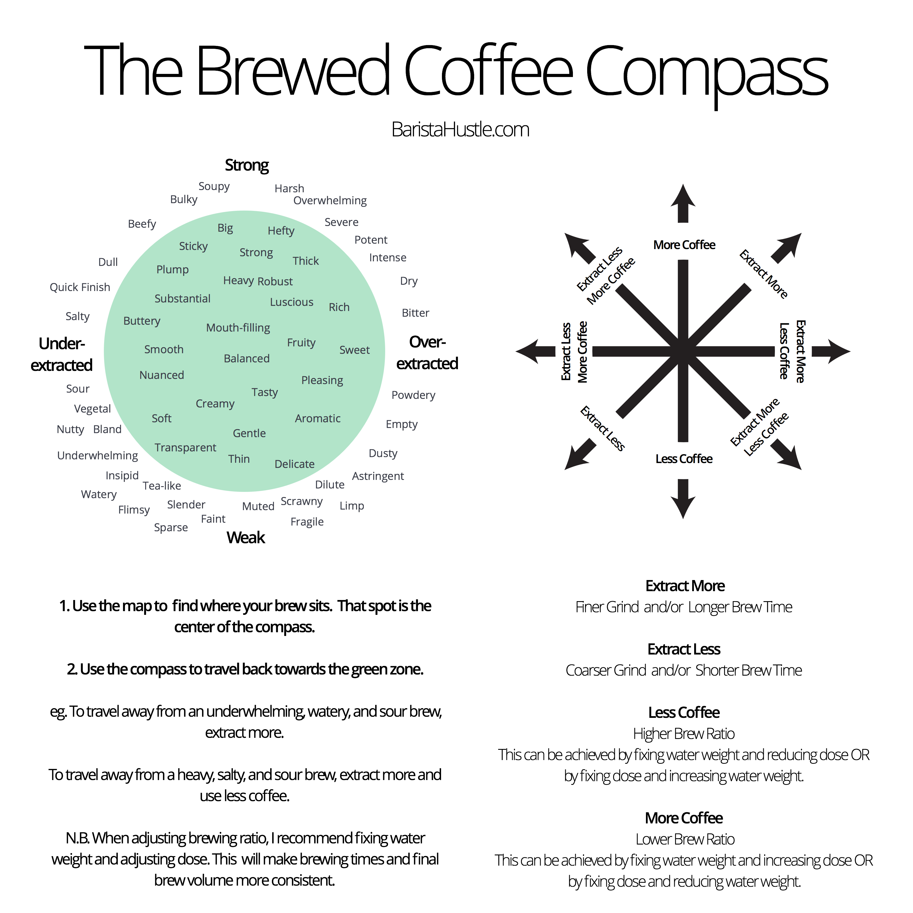

# kafi

I love brewing coffee. It is so many disciplines — cuisine, art, science, therapy — rolled into a 14 minute daily routine. I love the innovation happening in the coffee industry, from crazy but wonderful drinks like espresso tonic to new processes like anaerobic fermentation to newer exporters like the Nano Challa Cooperative.

Over the COVID-19 pandemic, I began to keep a journal of my daily V60 pourover, including notes on variables like coffee origin, grind size, and pour time. It was extremely helpful and pushed my technique drastically. Still, keeping a handwritten journal for a 14-minute routine was tedious — in most cases, my grind or coffee did not change, but for the sake of clarity, I wanted to include all these variables in every journal entry.

Recently, I began following [James Hoffmann's channel](https://www.youtube.com/channel/UCMb0O2CdPBNi-QqPk5T3gsQ). Three of his videos particularly inspired me:

- [The Ultimate V60 Technique](https://www.youtube.com/watch?v=AI4ynXzkSQo). I found this video at the passionate recommendation of a barista from [Mudhouse Coffee Roasters](https://mudhouse.com/). This got me thinking more about filter coffee as a technique in of itself.
- [The Ultimate Hand Grinder Showdown](https://www.youtube.com/watch?v=dn9OuRl1F3k). I never expected a GitHub repo to show up on a YouTube video. This [coffee-related GitHub project](https://github.com/jgagneastro/coffeegrindsize) by [Jonathan Gangé](https://github.com/jgagneastro) analyzes an image of coffee grinds to determine particle size distribution.
- [The World's Largest Coffee Tasting — Live!](https://www.youtube.com/watch?v=JI7PQu-i578) What an idea — a worldwide, remote tasting! I was again struck by the innovation happening in the world of coffee and its intersection with technology. Here I was introduced to the [coffee tasting guide from Prufrock Training and Consulting](http://bit.ly/HoffmannCoffeePDF).

I was inspired to combine both the journal and tasting aspects into a CLI (command line interface) that could generate JSON entries with static validation in [Visual Studio Code](https://code.visualstudio.com/).

## Prerequisites

This project requires:

- [Visual Studio Code](https://code.visualstudio.com/)
- [Node.js, version 14 or higher](https://nodejs.org/en/)

## Quick Start

1. Fork or clone the repo.

```shell
git clone git@github.com:manuscriptmastr/kafi.git
cd kafi
```

2. Setup the `kafi` CLI.

```shell
# install NPM dependencies
npm install
# add kafi command
npm link
```

3. Create a new journal entry.

```shell
# create a new journal entry with sane defaults
kafi journal <cupping|pourover>
```

4. Brew your coffee, then jot out your reactions to things like:

- What does the smell remind you of?
- What does that fruity note remind you of?
- Do you _like_ what you're tasting? What part of it do you like or dislike?
- How interesting is the overall flavor? Does it change, or is it rather one-dimensional?
- How does the coffee _feel_?
- How does your mouth feel during and after a sip?

5. Use the Coffee Compass to create an action step. For instance, a coffee with a soupy body and a lack of tasting notes suggests an over-extracted brew, so next time you would make your grind coarser or decrease the overall brew time.
   

## CLI

### Journal

```shell
# Create a new journal entry
kafi journal <cupping|pourover>
```

### Stats

```shell
$ kafi stats pourover --coffee.origin.region="Pitalito"
┌─────────┬──────────────┬─────────────────────────┬──────────────────────┬──────────────┬───────┐
│ (index) │     date     │     coffee.roaster      │ coffee.origin.region │ coffee.grind │ score │
├─────────┼──────────────┼─────────────────────────┼──────────────────────┼──────────────┼───────┤
│    0    │ '09/25/2020' │ 'Madcap Coffee Company' │      'Pitalito'      │      23      │   7   │
│    1    │ '09/26/2020' │ 'Madcap Coffee Company' │      'Pitalito'      │      23      │   2   │
│    2    │ '09/27/2020' │ 'Madcap Coffee Company' │      'Pitalito'      │      24      │   3   │
│    3    │ '09/28/2020' │ 'Madcap Coffee Company' │      'Pitalito'      │      24      │   8   │
│    4    │ '09/29/2020' │ 'Madcap Coffee Company' │      'Pitalito'      │      24      │   9   │
│    5    │ '09/30/2020' │ 'Madcap Coffee Company' │      'Pitalito'      │      24      │   5   │
│    6    │ '10/01/2020' │ 'Madcap Coffee Company' │      'Pitalito'      │      24      │   8   │
│    7    │ '10/02/2020' │ 'Madcap Coffee Company' │      'Pitalito'      │      24      │   7   │
│    8    │ '10/03/2020' │ 'Madcap Coffee Company' │      'Pitalito'      │      24      │   8   │
│    9    │ '10/04/2020' │ 'Madcap Coffee Company' │      'Pitalito'      │      24      │   5   │
│   10    │ '10/05/2020' │ 'Madcap Coffee Company' │      'Pitalito'      │      25      │   7   │
│   11    │ '10/06/2020' │ 'Madcap Coffee Company' │      'Pitalito'      │      24      │   7   │
│   12    │ '10/07/2020' │ 'Madcap Coffee Company' │      'Pitalito'      │      24      │   7   │
│   13    │ '10/08/2020' │ 'Madcap Coffee Company' │      'Pitalito'      │      24      │   8   │
└─────────┴──────────────┴─────────────────────────┴──────────────────────┴──────────────┴───────┘
```

```shell
# Basic use
kafi stats <cupping|pourover>
# Limit entries (defaults to last 30)
kafi stats pourover --limit 10
# Display specific fields (defaults to coffee.roaster, coffee.origin.country, coffee.grind, score)
kafi stats pourover --fields coffee.origin.region coffee.grind time
# Sort by fields (defaults to date)
kafi stats pourover --sort coffee.roaster score coffee.grind
# Filter results by properties
kafi stats pourover --equipment.grinder="Baratza Encore" --coffee.grind=23
```

## Developers

To build your own journal schema:
1. Create a new JSON Schema file at `{rootDir}/src/schema/{method}.json`. Common subschemas such as `coffee.json` and `water.json` are provided.
2. Run the `build-schema` command:
```shell
# Example: npm run build-schema --type=espresso --release=1.1
npm run build-schema --type={method} --release={version}
```

## Methods

### Chemex

- [The Chemex](https://youtu.be/ikt-X5x7yoc?t=427)

### Hario V60

- [The Ultimate V60 Technique](https://www.youtube.com/watch?v=AI4ynXzkSQo)
- [Scott Rao's V60 Method](https://www.youtube.com/watch?v=c0Qe_ASxfNM)
- [Hario V60 Pour Over by Matt Perger](https://vimeo.com/46612013)
- [4:6 Method](https://www.youtube.com/watch?v=wmCW8xSWGZY)

## Resources

- [Hoffmann Coffee Calculator](https://coda.io/@alessandro-mingione/hoffmann-coffee-calculator)
- [Coffee Flavor Wheel](https://notbadcoffee.com/flavor-wheel-en/)
- [Brewing Better Coffee](https://coffeeadastra.com/2018/11/30/brewing-better-coffee/)
- [POUR OVER THEORY: How I brew](https://medium.com/@dngilb/pour-over-theory-how-i-brew-6c07aff69ca4)
- [Some Observations on Hand Pours](https://www.scottrao.com/blog/2016/10/8/some-observations-on-hand-pours)
- [Coffee Extraction and How to Taste It](https://www.baristahustle.com/blog/coffee-extraction-and-how-to-taste-it/)

## How do I taste the difference between an underextracted and an overextracted brew?

_Assuming an evenly extracted cup,_ one of the strongest indicators of extraction is whether the unpleasantness of the cup is due to sourness or bitterness. However, the common phenomenon of **sour-bitter confusion** makes it frustratingly difficult to identify which, and therefore decide an action item. Here, I've consolidated some tips from the internet and my own experience.

Note: As an untrained hobbyist, I personally have not found **astringency** to be a helpful differentiator. Both under and overextracted cups can leave a dry, rubbing sensation in my mouth, so I use other indicators to diagnose the cup.

### Training your palate

- Brew two cups: one at a grind much too coarse (sour), and the other much too fine (bitter). Note the differences between the two.
- In front of a mirror, eat the flesh of a lemon, then the pith (the white part of the rind). Note how your face distorts for each.
- Roll a piece of aluminum foil into a small stick, place it and a metal spoon on your tongue, then touch the two edges together. This is similar to bitterness.

### Tasting your coffee

Look for multiple symptoms before diagnosing a cup as under or overextracted:

- **Very underextracted — vegetal, smooth, green**
  - Distinctly vegetal taste dominates the cup, like green beans, peas, or spinach
  - Little to no sourness
  - Little to no finish
- **Underextracted — aggressive, sour, puckery, yellow**
  - Strong green tea aftertaste
  - Strong acidic aftertaste
  - Acidity is clean but sour and lemon-like
  - Overall cup tastes diluted, watery, clean, and 'fresh'
  - Cup remains or becomes increasingly sour, lemon-like, and puckery as it cools
  - Little to no sweetness
  - Face distorts up and forward: mouth puckers, cheeks raise, eyes clench, lower jaw moves forward
  - Sides of tongue feel strange when you rub it along your teeth. (I get this sensation after brushing my teeth with Colgate toothpaste.)
  - You immediately reach for water after finishing the cup
- **Well extracted — sparkling, ripe, deep, complex, gold**
  - Sparkling, nuanced, juicy, syrupy, ripe, deep, easy to identify acidity
  - Overall cup is (paradoxically) transparent, rich, mouth filling, complex, and satiating
  - Taste of coffee changes over the course of a single sip
  - Long finish, neutral or refreshing mouthfeel
  - Qualities remain interesting and balanced as cup cools
- **Overextracted — lifeless, tangy, bitter, blue**
  - Slightly tangy or herbal 'other' quality colors the acidity when cup is hot. It will be noticeably different in taste than one grind coarser (thus what James Hoffmann calls "the wall of bitterness"). Often it may taste like stronger acidity or an herbal/floral note.
  - Acidity is muddy or hard to identify
  - Overall cup tastes thick, rich, muddy, and 'dull'
  - Cup becomes increasingly coin-like, metallic, medicinal, and zinc-like as it cools
  - Face distorts down and back: edges of lips pull down toward lower jaw, eyes and cheeks stay roughly the same
  - Your throat (the part known as the trachea) feels tight and closed
- **Highly overextracted — powdery, thick, bitter, brown**
  - Texture is thick and noticeably powdery
  - Overall flavor is indistinct and heavy like hotel coffee. (You may actually enjoy this!)
  - Sharp, bluish, coin-like bitterness makes the cup undrinkable as it cools
